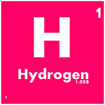
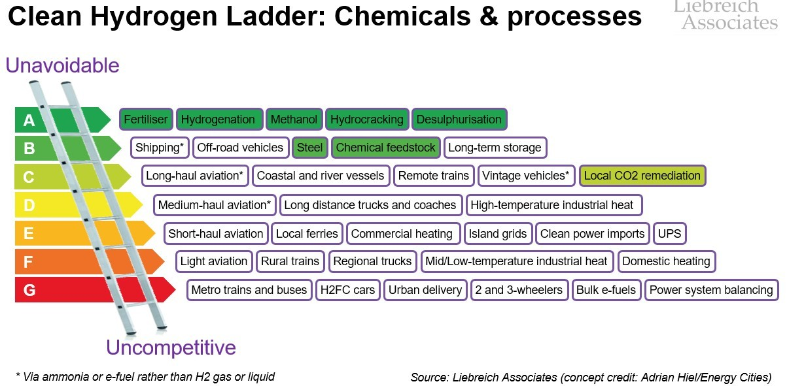
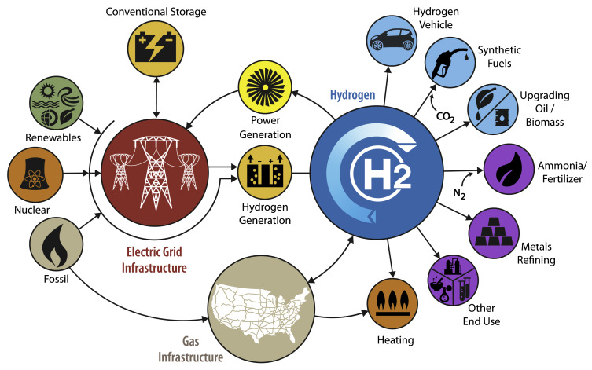
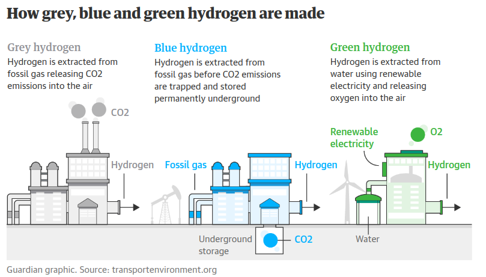
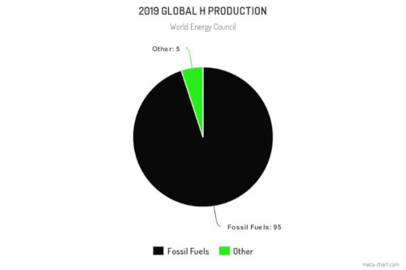

# Hydrodgen is bullsh\*\*t\*

(\*for most things)

---

## First, a quick primer

- Hydrogen is the most abundant element in the universe
- It's almost always bound to another element, takes a lot of energy to separate it
- We've known about Hydrogen for a long time (Lindenburg, Toyota FCHV-1)

---

## The H ladder

---DOWN

## The role of H

---DOWN

## What H is needed for?

- Fertiliser
- Petrochemical production

No real alternatives here

---

## The different 'colours' of H

---DOWN

### The different 'colours' of H

| Colour            | Production                         | Co2e     |
| ----------------- | ---------------------------------- | -------- |
| White             | Mining                             | ?        |
| Black             | Coal gasification                  | ?        |
| Grey              | Steam reforming methane            | 550g/kWh |
| Blue              | Steam reforming methane w/ "CCS"   | 486g/kWh |
| Green/Yellow/Pink | Electrolysis from Wind/Sun/Nuclear | 200g/kWh |

---DOWN

## Current H generation

- 830 Million Tonnes of Co2, 2% of global emissions
- only 1% is Blue hydrogen
- Burning methane directly produces ~550g/kWh

---

## H problems

---DOWN

## H problems

- It's really explosive
- Even with the best will in the world it leaks
  - It's the smallest element after all
  - It's a greenhouse gas
- Pressure/Temp
  - It turns liquid at -259.14&#8451;
  - or at 1.239 MPa / 179.7 psi

---

## Myth - H for short range transport is bulls\*\*t

- Two types: Electrolysis Vs Direct Combustion
- Cost $$$$

---DOWN

### Electrolysis based

- [Toyota FCHV-1 first released in 1996](https://en.wikipedia.org/wiki/List_of_fuel_cell_vehicles)
- Rare earth metals: Plantinum and Iridium
- ~50% efficiency
- Fueling stations keep failing
- Speed 0 to 60mph (for a &pound;50k car):
  - Toyota Mirai: 9.35s
  - Ford Mach-E: 3.8s

---DOWN

### Direct combustion

- Hydrogen Embrittlement
  - Increased Maintenance
  - Higher quality parts - $$$$
- NOx (bad for health)
- Only ~25% efficiency
- H has low energy density by volume
  - Energy to keep H at -259.14&#8451; (low temp or high pressure)
- Can't keep it in your garage, it could blow up

---DOWN

#### H based cost

&pound;12 per kilo,~62 miles per kilo

So to do 60 Miles:

| power train          | cost/60 miles            |
| -------------------- | ------------------------ |
| Hydrogen Electrolsys | ~&pound;11.40            |
| Hydrogen Combustion  | ~&pound;22               |
| Diesel (40mpg)       | ~&pound;11.49            |
| Petrol (40mpg)       | ~&pound;10.02            |
| BEV (3 m/kWh)        | ~&pound;7.20/&pound;1.40 |

---DOWN

#### H based efficiency

Assuming we're using green electricity:

- 75 kWh of electricity to produce 1kg of Hydrogen (no transport and storage included)
- 1kg of hydrogen takes you **62 miles** in a Fuel Cell Car
- 75kWh of electricity into a Tesla Model Y gives you **240 miles**

---

## Myth - H for long transport is bulls\*\*t

- Shipping: Methane (5x less volume, far less explosive, tanks are cheaper)
- Long Haul Lorries: Diesel
- Flying: Kerosene is best until power/weight of batteries can come down

---

### Myth - H for heating is bulls\*\*t

- Hydrogen Embrittlement
- Twice as expensive as methane
- Distribution of hydrogen, replace all pipework and boilers
- Just burn methane and add more insulation
- \<TODO add heat pump data\>

---

## H is an excuse to keep polluting

[Hydrogen Council](https://en.wikipedia.org/wiki/Hydrogen_Council)

- Saudi Aramco
- Bp
- Shell
- Total Energies
- Toyota
- Indian Oil
- Toyota

---

## In Summa

<Hydrogen is good for this and not for this>

---

## Appendices

---DOWN

## References

---DOWN

### UK Pariliament report

The role of hydrogen in achieving net zero [https://publications.parliament.uk/pa/cm5803/cmselect/cmsctech/99/report.html]()

---DOWN

### Hydrogen car sales

Just 12 hyrdogen cars sold in 2021

---DOWN

### Blended hydrogen for heating is bulls\*\*t

Blending of natural gas with 20% hydrogen in home heating systems, is a key recommendations by the government's hydrogen "champion", [Jane Toogood](https://www.gov.uk/government/news/hydrogen-champion-appointed-as-government-accelerates-uk-hydrogen-investment)

> Using grid blending to shore up hydrogen demand creates unfair costs for consumers: A 20% hydrogen blend would increase gas costs by around 16%, while only reducing emissions by 7%, due to inefficiencies in burning hydrogen. -- [e3g.org]()

- [coalition-warns-against-blending-hydrogen-into-the-gas-grid](https://www.e3g.org/news/coalition-warns-against-blending-hydrogen-into-the-gas-grid/)
